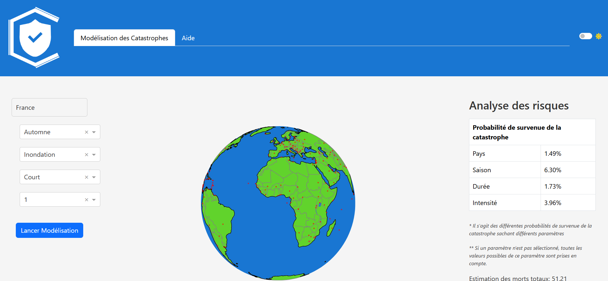
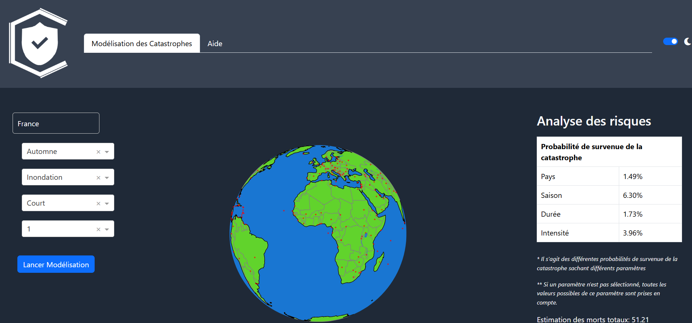
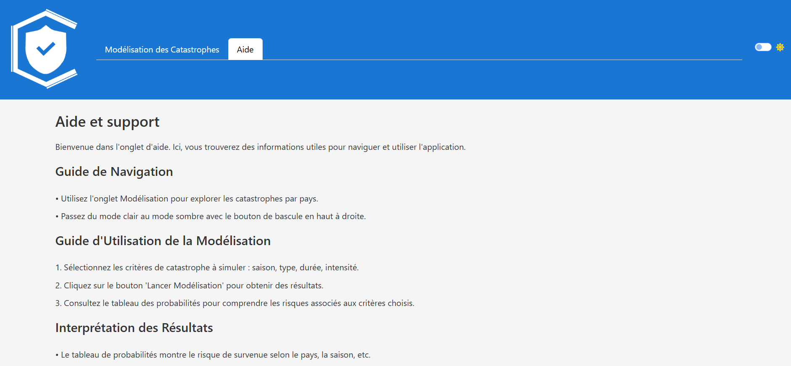
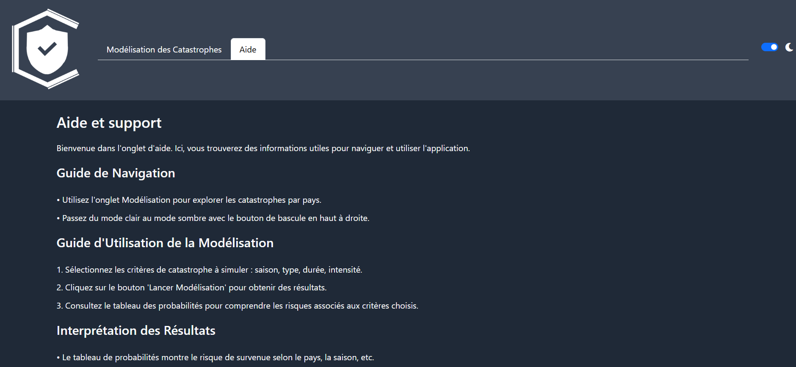

# Neter



## Tableau de Bord de Modélisation des Catastrophes

Neter est un tableau de bord interactif basé sur Dash, conçu pour modéliser les probabilités de survenue de catastrophes naturelles ainsi que des estimations des pertes humaines et des dommages matériels. Grâce à une interface utilisateur intuitive, les utilisateurs peuvent explorer les impacts potentiels des catastrophes sur la base de divers critères sélectionnables.

## Table des Matières

- [Description](#description)
- [Fonctionnalités](#fonctionnalités)
- [Technologies Utilisées](#technologies-utilisées)
- [Installation](#installation)
- [Utilisation](#utilisation)
- [Structure du Projet](#structure-du-projet)
- [License](#license)
- [Aide et FAQ](#aide-et-faq)

## Description

Neter permet aux utilisateurs de modéliser des catastrophes naturelles à l'aide des éléments suivants :
- **Localisation** : Sélection du pays sur un globe terrestre.
- **Type de Catastrophe** : Choix parmi différents types de catastrophes.
- **Durée et Intensité** : Sélection à partir de menus déroulants.
- **Saison** : Choix de la saison pour affiner les modélisations.

En appuyant sur le bouton "Lancer la modélisation", les utilisateurs obtiennent des résultats détaillés sur les probabilités d'événements catastrophiques, ainsi que des estimations de morts totales et de dommages en dollars, affichés sur le côté droit de l'application.

**Modes Light et Dark** : Neter offre la possibilité de basculer entre un mode light et un mode dark, permettant ainsi aux utilisateurs de choisir leur style de visuel préféré.

**Modélisation**

<div style="display: flex; justify-content: space-between;">
    
    
</div>

**Aide**

<div style="display: flex; justify-content: space-between;">
    
    
</div>

## Fonctionnalités

- **Interface Interactive** : Utilisation d'un globe terrestre pour sélectionner la localisation.
- **Modélisation Prédictive** : Calculs des probabilités et des estimations basés sur des données historiques.
- **Section Aide** : Explication du fonctionnement de l'application.
- **FAQ** : Réponses aux questions courantes sur l'utilisation de l'application.

## Technologies Utilisées

- [Dash](https://dash.plotly.com/) - Framework pour construire des applications web analytiques.
- [Dash Bootstrap Components](https://dash-bootstrap-components.opensource.faculty.ai/) - Composants Bootstrap pour une interface élégante.
- [Pandas](https://pandas.pydata.org/) - Bibliothèque pour la manipulation des données.
- [NumPy](https://numpy.org/) - Bibliothèque pour le calcul numérique.
- [Plotly](https://plotly.com/python/) - Outils de visualisation de données interactives.
- [Flask](https://flask.palletsprojects.com/) - Framework web utilisé par Dash.
- [Requests](https://docs.python-requests.org/en/latest/) - Bibliothèque pour faire des requêtes HTTP.

## Installation

Pour installer Neter, suivez ces étapes :

1. Clonez le dépôt :

   ```bash
   git clone https://github.com/Moussakado/Neter.git
   cd Neter
   ```

2. Créez un environnement virtuel (recommandé) :

   ```bash
   python -m venv env
   source env/bin/activate  # Sur Windows, utilisez `env\Scripts\activate`
   ```

3. Installez les dépendances :

   ```bash
   pip install -r requirements.txt
   ```

## Utilisation

Pour exécuter l'application, utilisez la commande suivante :

```bash
python app.py
```

L'application sera accessible à l'adresse `http://127.0.0.1:8050/`.

## Structure du Projet

Le projet est structuré comme suit :

```
Neter/
│
├── assets/
│   ├── logo_classique.png   # Logo classique
│   ├── logo_dark.png         # Logo sombre
│   ├── logo_light.png        # Logo clair
│   ├── logo_onglet.png       # Logo de l'onglet
│   ├── layout1_light.png     # Onglet modélisation en light
│   ├── layout2_light.png     # Onglet modélisation en dark
│   ├── layout1_dark.png      # Onglet aide en light
│   └── layout2_dark.png      # Onglet aide en dark
│
├── data/
│   ├── countries_data.json    # Coordonnées des pays
│   └── world_disaster.csv      # Historique des catastrophes
│
├── app.py                     # Fichier principal de l'application
├── globe.py                   # Gestion de la carte
├── index.html                 # Page d'accueil
├── LICENSE.txt                # Licence du projet
├── .gitignore                 # Fichiers à ignorer par Git
├── requirements.txt           # Dépendances du projet
└── README.md                  # Documentation du projet
```

## License

Ce projet est sous la licence MIT. Voir le fichier LICENSE pour plus d'informations.

## Aide et FAQ

Pour toute question ou besoin d'aide concernant l'utilisation de Neter, veuillez consulter l'onglet Aide intégré dans l'application. La section FAQ répond également aux questions les plus fréquentes sur l'utilisation de l'application.
